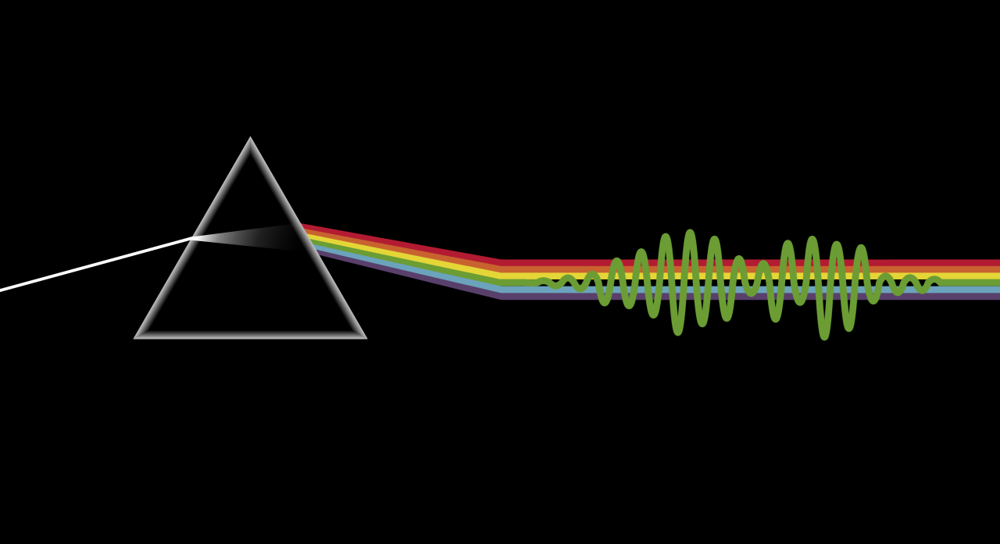
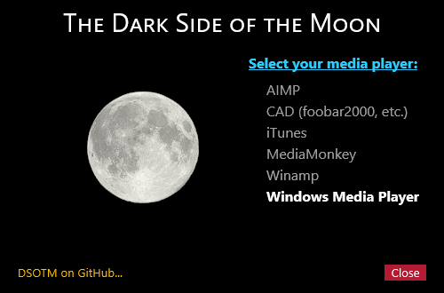

# Dark Side of the Moon
**A Visualizer for Rainmeter.**

One of the greatest progressive rock albums of all time is Pink Floyd's _The Dark Side of the Moon_ (1973). After the album's release, it remained on the Billboard Top 100 charts in the US for a whopping 954 weeks (that's more than 18 years and 4 months!).

Anyone who's heard of Pink Floyd, or _The Dark Side of the Moon_ (aka, _DTSOM_), has certainly seen one of the most iconic album covers ever made: completely black, with no title or name of the band, just a prism refracting a beam of white light. Inside the gatefold cover, along with the song lyrics, the refracted light beam continues across -- with the signature "heartbeat" -- and wraps around to the back cover. The back contains another prism, concentrating the prismatic rays back into a white ray of light which wraps around to the front, to start the cycle over again.

Back in 2018, I decided to celebrate the 45th anniversary of the album by creating a visualizer in the style of the album cover, using nothing but Shape meters and math. Ha! I never completed the task due to the complexity involved, but I finally completed it over a long weekend. While not _quite_ as cool as the real thing, this visualizer comes as close as I can get without a gatefolding double-sided monitor.

###### Get help on the Rainmeter forums
[![Rainmeter Forum](https://img.shields.io/static/v1?label=Rainmeter%20Forum&message=Dark%20Side%20of%20the%20Moon&colorA=f0f0f0&colorB=2a6e9b&style=flat-square&logo=data%3Aimage%2Fpng%3Bbase64%2CiVBORw0KGgoAAAANSUhEUgAAAAsAAAAQCAYAAADAvYV%2BAAAABHNCSVQICAgIfAhkiAAAAAlwSFlzAAAESwAABEsBbzH2CgAAABl0RVh0U29mdHdhcmUAd3d3Lmlua3NjYXBlLm9yZ5vuPBoAAAH6SURBVCiRhdJPSJNhHAfw7%2FO8z%2Fu8%2F3w3bW05WVlr4XRzyw0iFRfF7FIepD8UQn9Mq8MWBnXpsPDapVuhyyKKqE4lHSoKqUPUwYQkgkqtiBAcCTU22db7dLFyueh3%2FPHh%2B%2BUHP6DCNCTS6yrt6d8LX%2FKyU2HSS39iqPm%2F2KXLF7aHvKajSr8BCPJPHDwx3GbT1c4z3TGpub62PnLq6qHKeM9tydS0a6ldW%2ByUEJze2W5yKp3bOHClehmOrM72tW7wOJs8TgCAw9Swvz1oU7g0WIajR4dkzthgfzxqLq3d1xbkFDgQOn7R9RtbVXJfrHGt7q4us1Bkhp6OsG7YjdQiFoQzluqPR8rlr1M2N3EI9PiS123Un0zH%2FHUOvlLnKH5%2BCuvbp2XpnWGfrEuFvUzjfNvWgLcm%2FyyFwtQdAAR8fRfUyACo4YY1%2FxaxBo8x9npmB5MAVZYoIbK2mCVQmBpFYfoeqOEGkRSwlhGACJXmiqWHD169n1eCvSDc9qdfWLCyX6C2JPB4ciaXzRdGpbkXdz%2Fooee77XaXK9RxmArLAmEq2KootNazmMh7xcjY%2BGwmI44QAAicvLTC5PxReE2tt3tTo72uxkTmew73J95ln7z5OJcrleKT53unlzyKIIFEusthMw5aQtRTgtmv2YVbysKPm%2BPDx4oA8BMJrI6FKL9sKAAAAABJRU5ErkJggg%3D%3D)](https://forum.rainmeter.net/viewtopic.php?f=130&t=20699)

## Features
NOTE: Because this visualizer spans the complete width of your monitor, it is set to "click-through" so as to not interfere with your Windows desktop. The downside is that there is no way to interact with the skin. A Settings skin is provided and must be loaded either with the Rainmeter Manage dialog or by using the Rainmeter taskbar icon to select it.

Also, this skin is a visualizer **only**. It cannot and will not control your media player. You can use your preferred player skin for this task.

## Configuration

There are only a few simple settings for the visualizer.
* Click the moon/eclipse to toggle the visualizer on/off.
* Select your preferred media player from the list (these are players supported natively by Rainmeter).
* Queue up album (preferably the remastered 5.1 mix), turn out the lights, and crank the volume! (Also playing the _Wizard of Oz_ is optional.)

For best appearance, and to show the world how much of a die-hard Floyd fan you are, set your desktop wallpaper to solid black, like the album cover. Lesser fans can opt for a near-black desktop, though you may invite mild derision for your lack of dedication.

## Attribution
* [Dark Side of the Moon](https://github.com/SilverAzide/Dark-Side-of-the-Moon/#readme) by [SilverAzide](https://github.com/SilverAzide).
* [ConfigActive](https://forum.rainmeter.net/viewtopic.php?f=18&t=28720) plugin by JSMorley.

## License
Creative Commons Attribution-NonCommercial-ShareAlike 4.0 International (CC BY-NC-SA 4.0)

---

